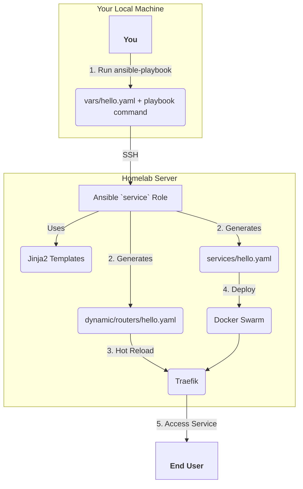

# Homelab Infrastructure Automation

Ansible-based homelab infrastructure automation system using Docker Swarm for container orchestration and Traefik for reverse proxy with dynamic routing.

## Table of Contents

- [Features](#features)
- [Quick Start](#quick-start)
  - [Prerequisites](#prerequisites)
  - [Configuration](#configuration)
  - [Initial Setup](#initial-setup)
- [Service Management](#service-management)
  - [Adding Services](#adding-services)
  - [Service Variables](#service-variables)
  - [Updating Services](#updating-services)
- [Directory Structure](#directory-structure)
- [Architecture](#architecture)

## Features

- **Docker Swarm Orchestration**: Automatic swarm initialization and overlay networking
- **Traefik Reverse Proxy**: Dynamic file-based routing with automatic service discovery
- **Template-driven Deployment**: Consistent service deployment using Jinja2 templates
- **Hot Reload**: Route updates without service restarts
- **Automated Maintenance**: Log rotation and system cleanup via cron jobs

## How It Works

This system is designed to automate the deployment of services to a Docker Swarm cluster. Here’s a visual overview of the workflow when you add a new service:



**Workflow Steps:**

1.  **Run Playbook**: You execute the `ansible-playbook` command from your local machine, targeting your homelab server. You pass a service definition file (e.g., `vars/hello.yaml`) containing all the necessary variables for your new service.
2.  **Generate Configs**: Ansible connects to the server via SSH. The `service` role uses Jinja2 templates to generate two critical files based on your variables:
    *   A Docker Compose file in `/opt/homelab/services/` that defines your application as a Docker Swarm service.
    *   A Traefik routing configuration file in `/opt/homelab/dynamic/routers/` that tells Traefik how to route traffic to your new service.
3.  **Hot Reload**: Traefik is configured to use Docker for service discovery and a file provider for dynamic routing. It automatically detects the new routing file and reloads its configuration on the fly, without requiring a restart.
4.  **Deploy**: The Ansible playbook uses the `docker_stack` module to deploy your service to the Docker Swarm cluster. Docker Swarm ensures the service is running according to your definition (e.g., correct image, replicas, etc.).
5.  **Access Service**: The service is now live and accessible to end-users through the Traefik reverse proxy at the host and path you defined.

## Quick Start

### Prerequisites

- Ansible installed on control machine
- SSH access to target server (configure in `inventory.ini`)
- Docker installed on target server

### Configuration

Copy and configure the inventory file:
```bash
cp example.inventory.ini inventory.ini
# Edit inventory.ini with your server details (host, user, SSH key path)
```

**⚠️ Security Note**: Keep `inventory.ini` secure as it contains sensitive connection details.

### Initial Setup

Bootstrap the entire homelab infrastructure:
```bash
ansible-playbook -i inventory.ini playbooks/initialize.yaml -e "main_domain=yourdomain.com"
```

This will:
- Create necessary directories
- Initialize Docker Swarm
- Set up overlay network
- Deploy Traefik with dynamic routing (dashboard accessible at yourdomain.com/traefik/dashboard)
- Configure log rotation and maintenance cron jobs

**Required:** Replace `yourdomain.com` with your actual domain where Traefik will be accessible.

## Service Management

### Adding Services

Create a vars file for your service in the `vars/` directory:

```yaml
# vars/hello.yml
name: hello
image: devmuhfaris/hello-world
port: 80
host: apps.yourdomain.com
path: /hello
replicas: 1
```

For services with static assets (Next.js, React, etc.), add assets routing:
```yaml
# vars/webapp.yml
name: webapp
image: yourorg/webapp:latest
port: 3000
host: apps.yourdomain.com
path: /webapp
replicas: 2
priority: 2000
assets_paths:
  - "/_next/"
  - "/favicon.ico"
  - "/robots.txt"
  - "/static/"
```

Deploy the service:
```bash
ansible-playbook -i inventory.ini playbooks/add-service.yaml --extra-vars @vars/hello.yml
```

### Service Variables

**Required:**
- `name`: Service identifier
- `image`: Docker image reference
- `port`: Internal service port
- `host`: External hostname
- `path`: URL path for routing

**Optional:**
- `replicas`: Number of service replicas (default: 1)
- `priority`: Traefik routing priority (default: 2000)
- `assets_paths`: List of asset paths for separate routing
- `assets_priority`: Priority for assets router (default: priority + 1000)
- `cpu`: CPU allocation per replica (default: "0.25")
- `memory`: Memory allocation per replica (default: "64M")
- `command`: The full command to run in the container. You are responsible for including any flags needed to read a configuration file.
- `service_config`: A dictionary of structured configuration data to be mounted as a file into the container.
- `service_config_format`: The format of the configuration file (`yaml` or `json`). Defaults to `yaml`.
- `service_config_target_path`: The full path inside the container where the configuration file will be mounted (e.g., `/app/config.yaml`). Defaults to `/<name>.config.<format>`.
- `service_config_name_override`: Allows you to specify a custom name for the Docker Swarm config resource, overriding the auto-generated hashed name.
 - `internal_only`: When `true`, skips Traefik routing and HTTP labels (for DBs/queues). `host`, `path`, and `port` are not required.
 - `env` / `env_vars`: Map of environment variables for the container. Avoid using `environment` as a var name (reserved by Jinja/Ansible).
 - `ports`: List of published ports (e.g., `[{ target: 5432, published: 5432 }]`). Optional fields: `protocol`, `mode`. If `mode` is omitted, Swarm defaults to `ingress`.
 - `volumes`: List of named volume mounts (e.g., `[{ name: pgdata, target: /var/lib/postgresql/data }]`).
 - `healthcheck`: Compose-style healthcheck fields: `test`, `interval`, `timeout`, `retries`, `start_period`.

### Updating Services

Modify your vars file and redeploy:
```bash
ansible-playbook -i inventory.ini playbooks/add-service.yaml --extra-vars @vars/hello.yml
```

Changes to routing configuration trigger hot reloads. Changes to image or replicas trigger rolling updates.

### Internal Services (Databases, Caches)

For services not exposed via Traefik, set `internal_only: true` and provide only what the container needs (e.g., env, volumes, optional published ports):

```yaml
# vars/redis.yml
name: redis
image: redis:7-alpine
internal_only: true
command: "redis-server --appendonly yes"
volumes:
  - name: redis-data
    target: /data
ports:  # optional, if you want LAN access
  - target: 6379
    published: 6379
    mode: host
```

Postgres example with env variables:

```yaml
# vars/db_idcards.yaml
name: db_idcards
image: postgres:16-alpine
internal_only: true
env:
  POSTGRES_DB: app
  POSTGRES_USER: app
  POSTGRES_PASSWORD: change-me
volumes:
  - name: db_idcards_data
    target: /var/lib/postgresql/data
```

### Advanced: Using Configuration Files

For applications requiring a configuration file, you have full control over how it's mounted and used. The system no longer automatically injects any command-line flags, giving you the flexibility to support any application.

#### How It Works
When you define `service_config` in your service's variable file, the system creates a Docker Swarm config object from your data. You then tell your application how to use it.

1.  **Define the Configuration Content**: Add your structured data to the `service_config` variable.
2.  **Specify the Mount Path**: Use `service_config_target_path` to define exactly where the configuration file should be placed inside your container. This path should match what your application expects.
3.  **Provide the Full Command**: Use the `command` variable to specify the *exact* command to run your application, including the flag needed to read the config file (e.g., `-c`, `--config-file`, etc.).

#### Example
Here’s an example of a service that uses a custom flag (`-c`) and a custom path (`/etc/my-app/settings.yaml`) for its configuration:
```yaml
# vars/my-app.yml
name: my-app
image: my-org/my-app:latest
port: 8080
host: apps.yourdomain.com
path: /my-app

# 1. Define the config content
service_config:
  database:
    host: db.internal
    port: 5432
  api_keys:
    - key: "key1"
      value: "value1"

# 2. Specify the target path inside the container
service_config_target_path: /etc/my-app/settings.yaml

# 3. Provide the full command, including the custom flag and path
command: "node server.js -c /etc/my-app/settings.yaml"
```

In this example:
- A configuration file is created from the `service_config` data.
- It is mounted inside the container at `/etc/my-app/settings.yaml`.
- The service's command is executed *exactly* as `node server.js -c /etc/my-app/settings.yaml`.

This approach gives you the flexibility to work with any application, regardless of its specific command-line arguments.

## Directory Structure

```bash
/opt/homelab/                   # Root directory 
├── dynamic                     # Traefik dynamic routing
│   └── routers
│       └── hello.yaml 
├── hl-traefik.yaml
└── services                    # Docker Compose files
    └── hello.yaml

/var/log/traefik/               # Traefik logs
├── access.log                  # Access logs  
├── traefik.log                 # Application logs
```


## Architecture

The system uses a modular Ansible role structure:

- **common**: Infrastructure bootstrap and maintenance
- **traefik**: Reverse proxy configuration and dynamic routing
- **service**: Template-driven service deployment

Services are deployed as Docker Swarm services with automatic Traefik integration for routing and load balancing.
